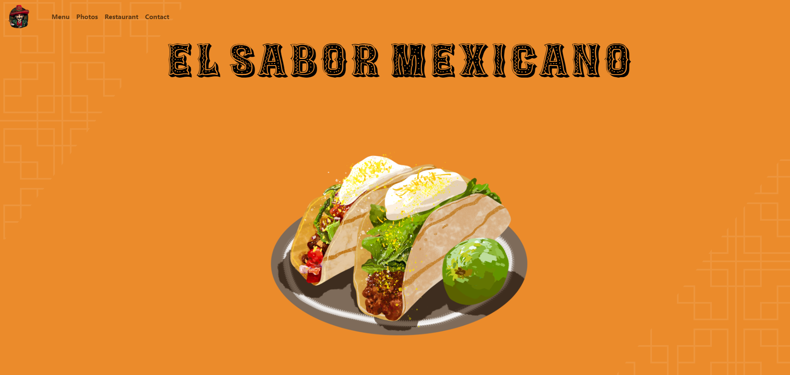
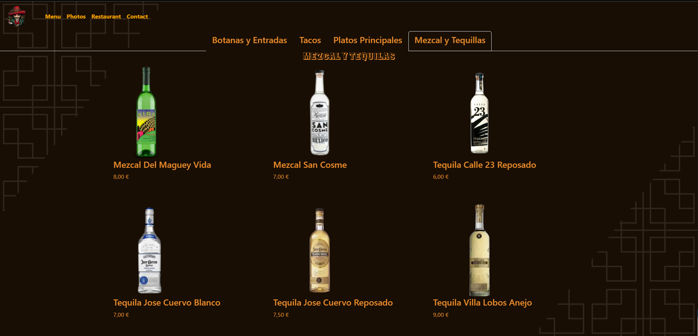

# Restaurant El Sabor Mexicano - Projet de Site Web

El Sabor Mexicano est un restaurant fictif inspiré de la cuisine mexicaine, situé à Bruxelles.

Ce projet a été créé à des fins d'apprentissage et de démonstration pour mettre en pratique l'utilisation de Bootstrap, dans le développement web chez BeCode.

## Présentation du Projet

Le site web du restaurant El Sabor Mexicano présente une interface utilisateur, avec des fonctionnalités de navigation faciles à utiliser. Il comprend les sections suivantes :

- **Accueil** : Une page d'accueil, avec une animation de chargement à l'ouverture de la page.
- **Menu** : Une section décrivant les différents plats et boissons offerts par le restaurant, répartis en catégories.
- **Photos** : Une galerie de photos
- **Restaurant** : Des détails sur l'emplacement du restaurant, ses heures d'ouverture et des informations de contact.
- **Contact** : Un formulaire de contact pour permettre aux visiteurs de poser des questions ou de faire des réservations.

## Captures d'écran

